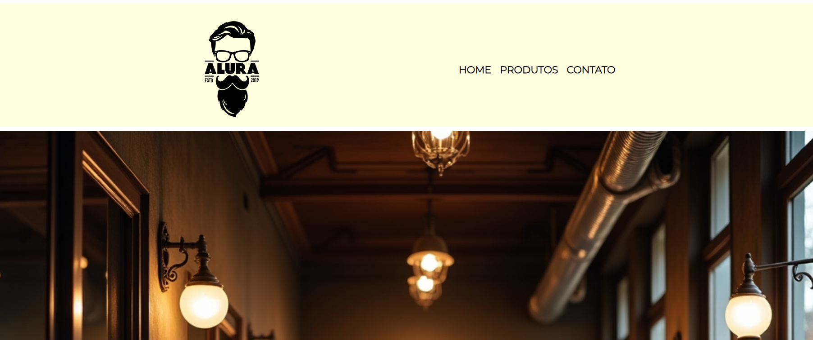
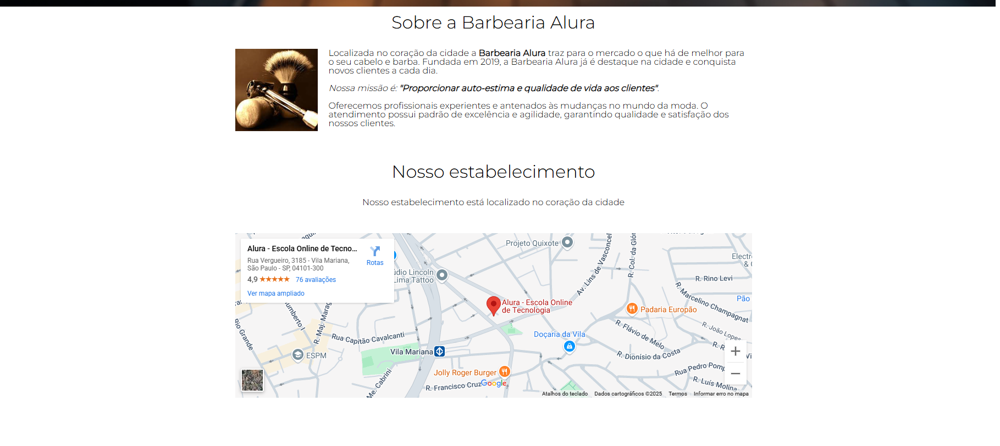
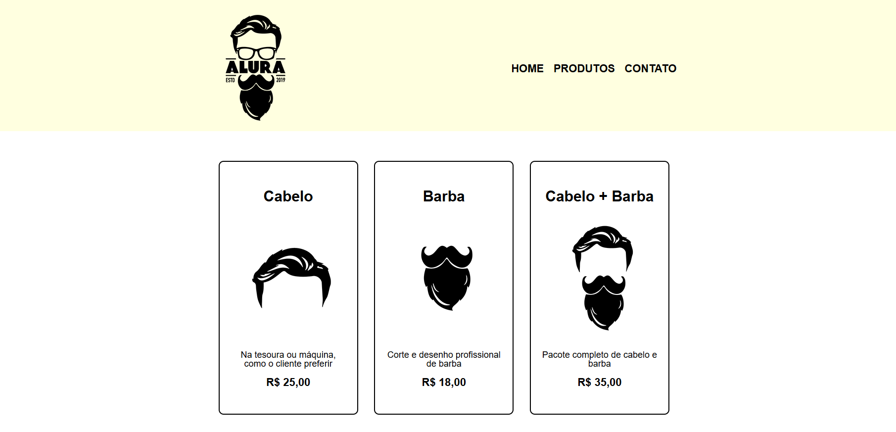
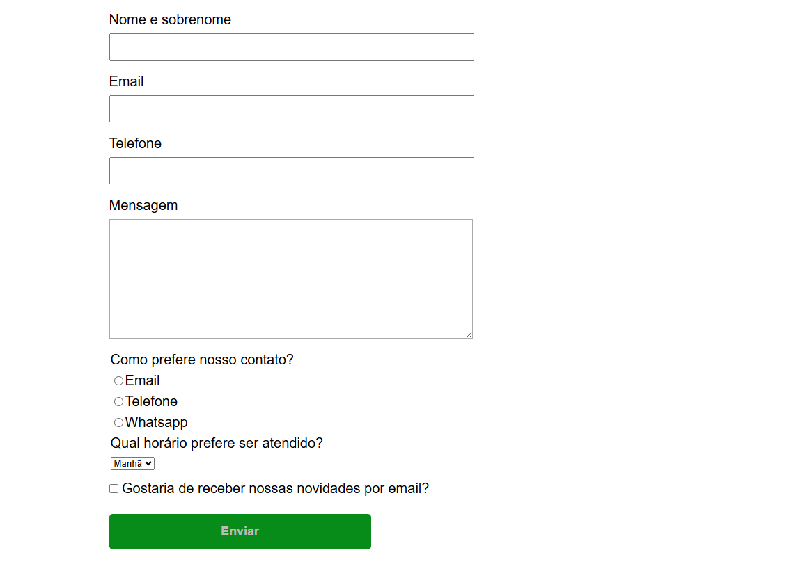
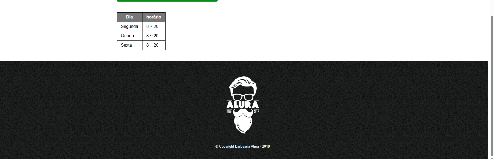

<h1 align="center">BarberShop Alura</h1>

  <strong>🚀 Descrição do Repositório </strong>

  
Criação de uma página de barbearia

  
Tela de home, produtos e contato.

## 🔭 Visão Geral

  

  

  

  

  

  

